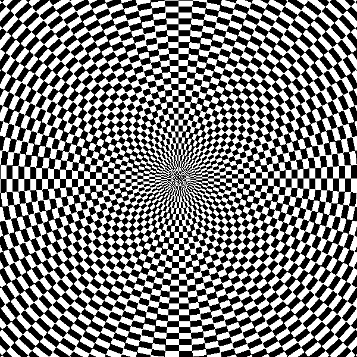

# Functional Images

Chapter 7 of The Fun of Programming by Jeremy Gibbons and Oege de Moor.

I haven't found a way to generate animated gifs in F# using mono (mono does not have .Net WPF). Below is an illustration of 60 images generated by the program.

