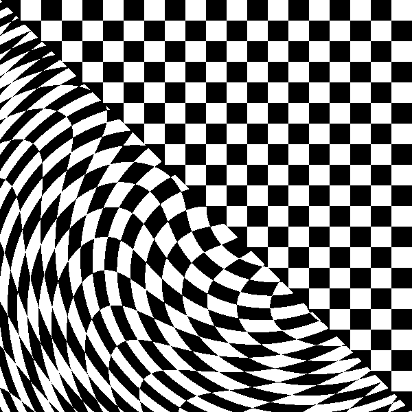

# Functional Images

As an attempt at modelling images as functions from the plane to types (e.g. colors) we implement a domain-specific language called Pan in F#. Pan is presented by Conal Elliott in Chapter 7 of The Fun of Programming (2003, Jeremy Gibbons and Oege de Moor). 

I haven't found a way to generate animated gifs in F# using mono (mono does not have .Net WPF). Below is an illustration of animations generated by the program.

   
